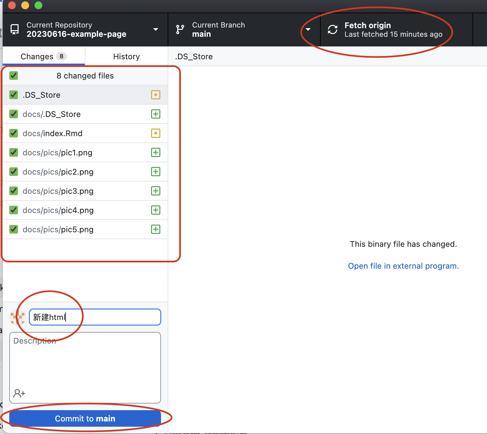

```{r setup, include=FALSE}
knitr::opts_chunk$set(echo = TRUE)
```

选修“环境数据分析与可视化”的同学们，你们好，这个网页是为你而建的。这是这学期我们这门课的最后一讲，你将学习如何建一个完全由你控制的，专业的，学术的网页，并把这个网页托管在GitHub网站，向全世界开放，展示你的想法、学术笔记、科研成果等等。

## 1. 注册GitHub账号  
打开以下链接，用你的常用永久邮箱（例如QQ邮箱、foxmail等）注册GitHub账号，注意不要用大学邮箱、学生邮箱等非永久的邮箱注册，以免哪天就不能用了。
github网站链接：https://github.com/


## 2. 在GitHub中创建仓库

打开浏览器，转到你的GitHub页面。创建一个新的仓库（Create a new repository）。  

* 输入“Repository name”，在以下的示例中，我将创建名为“20230616-example-page”的仓库。  

<br/> 

```{r img-with-knitr, echo=FALSE, fig.align='center', out.width='100%', fig.cap=' '}
knitr::include_graphics("pics/pic1.png")
```

<br/>   
  


* 勾选“Add a README file”（非必需）。  

* 拉到页面下方，点击绿色“Create  repository”按钮，保存。  


<br/> 

```{r img-with-knitr2, echo=FALSE, fig.align='center', out.width='100%', fig.cap=' '}

```

<br/> 

接下来，我们会把html文件保存到这个仓库中。  


## 3. 下载GitHub桌面版

从以下链接下载并安装GitHub桌面版：
https://desktop.github.com/

  
## 4. 打开GitHub桌面应用程序
* 打开GitHub应用程序，登录账号（可能因为网络连接问题，反应较慢），你将看到“Let's get started”页面。   
* 点选页面右侧"20230616-example-page”的仓库,然后点击下方的蓝色“Clone...”按钮。  
* 你会看到窗口弹出，提示你设定计算机上的文件夹地址，用以保存你克隆的仓库。目前建议选择默认的地址，并记住这个地址。
* 进入以上文件夹，新建名为docs的文件夹。我们接下来会把html文件保存到这个文件夹中。  

<br/> 

```{r img-with-knitr3, echo=FALSE, fig.align='center', out.width='33%', fig.cap=' '}
knitr::include_graphics("pics/pic2.png")
```

<br/> 


## 5. 设置 GitHub 页面功能

* 返回浏览器，打开的GitHub仓库，例如 https://github.com/tan-qiao-guo/20230616-example-page  
* 点击“Settings”选项卡。  

<br/> 

```{r img-with-knitr4, echo=FALSE, fig.align='center', out.width='100%', fig.cap=' '}

```

<br/> 

  
  
* 点击左侧“Pages”选项卡，在此设置GitHub页面功能。   

<br/> 

```{r img-with-knitr5, echo=FALSE, fig.align='center', out.width='100%', fig.cap=' '}
knitr::include_graphics("pics/pic4.png")
```

<br/> 
  
  
  
* 如上图所示，将“none”改为“main”，填入文件地址“docs”，单击“Save”，保存设置。  

* GitHub 将生成一个url链接（如上图长条椭圆中所示）。这可能需要好几分钟才会出现，需耐心等待，每隔几分钟刷新一次看看。  


## 6. 创建R Markdown html文件

* 在RStudio中新建一个R Markdown文件，编辑内容。  

* 单击“Knit”并选择“Knit to HTML”，保存html文件到上面建立的“docs”文件夹中，并将html 文件命名为“index”，你会在“docs”文件夹中看到“index.html”和“index.Rmd”两个文件。  

<br/> 

```{r img-with-knitr6, echo=FALSE, fig.align='center', out.width='40%', fig.cap=' '}

```

<br/> 

## 7. 推送文件到仓库中  

* 返回到GitHub应用程序，如下图所示，可以看到所做的更改  

<br/> 

```{r img-with-knitr7, echo=FALSE, fig.align='center', out.width='70%', fig.cap=' '}

```

<br/> 

* 输入简单描述，即可激活蓝色“Commit to main”按钮（如上图）  

<br/> 

```{r img-with-knitr8, echo=FALSE, fig.align='center', out.width='70%', fig.cap=' '}

```

<br/> 


* 点击上方“Push origin”，以完成推送。由于网络问题，时常会出现反应慢、推送失败等情况，多试几次，终会成功。


## 8. 查看网页

在浏览器中打开第5步中提到的url链接，刷新，稍等片刻即可看到更新后的网页。


## 参考资料：

https://mbounthavong.com/blog/2022/7/30/hosting-a-r-markdown-html-file-on-a-github-page
